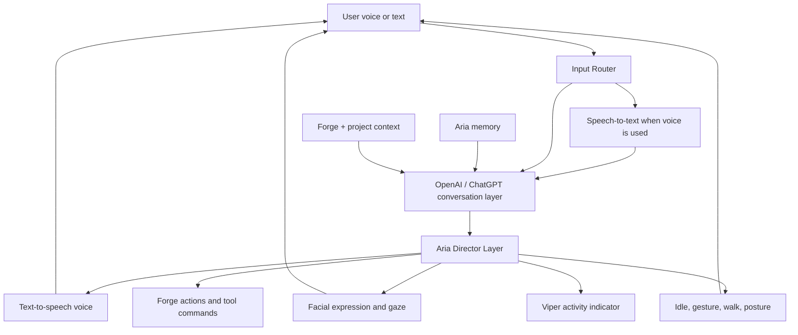

# Aria Director Layer

Status: active architecture direction

Aria must not be treated as text chat with a character picture attached. Aria needs a Director Layer that converts conversation into visible character behavior.

## Decision

Mantella is a design reference, not a dependency.

Viper Studios will build its own Aria Director Layer for the protected CC5 Aria asset.

## Reference Pattern

Mantella proves that game characters can use:

- Speech-to-text
- LLM conversation
- Character/personality prompts
- Conversation memory
- Text-to-speech
- In-game response playback
- In-game actions

Herika-style companion systems add another useful concept: a narrator/action layer that interprets AI intent into game behavior.

Viper should adapt the architecture pattern, not install or copy those projects.

References:

- Mantella GitHub: https://github.com/art-from-the-machine/Mantella
- Mantella docs: https://art-from-the-machine.github.io/Mantella/
- Herika / Dwemer Dynamics: https://dwemerdynamics.com/herika/index.html
- Herika Server: https://github.com/abeiro/HerikaServer

## Viper Difference

Mantella plugs into existing Skyrim/Fallout NPC systems.

Viper Studios owns the character runtime, the Forge, the avatar viewer, the asset pipeline, the memory system, and the creator tools.

That means Aria needs direct control over:

- Protected CC5 avatar loading
- Idle animation
- Walk animation
- Head movement
- Eye gaze
- Blinks
- Facial expressions
- Gesture clips
- Voice playback
- Lip sync / visemes
- Forge tool actions
- Loading/thinking/working indicators
- Project memory
- Wardrobe loadouts

## Director Pipeline

## Director Output V1

The first runtime directive contains:

- Emotion
- Intent
- Speech phase
- Gaze target
- Gesture
- Viewer expression
- Speaking duration

This is intentionally small. It gives Viper a stable bridge from "Aria replied" to "Aria visibly reacts."

## Director Output Later

Future versions should add:

- Animation clip name
- Facial blend shape weights
- Viseme timeline
- Eye target vector
- Head target vector
- Gesture intensity
- Walk target
- Outfit/loadout action
- Forge command
- Autonomous suggestion
- Memory write instruction

## Current Implementation

Initial files:

- `artifacts/api-server/src/lib/ariaDirector.ts`
- `artifacts/api-server/src/routes/aria.ts`
- `artifacts/viper-studio/lib/ariaDirector.ts`
- `artifacts/viper-studio/app/(tabs)/chat.tsx`
- `artifacts/viper-studio/components/AriaZoneChat.tsx`

The server now emits an `aria-director-v1` directive after each Aria response. The app uses that directive to choose Aria's visible expression instead of relying only on text guessing.

The app also stores the latest directive in shared app state as `ariaDirector`. The 3D viewer listens to that state and forwards the first runtime controls to the viewer scene:

- `viewerExpression` -> Aria expression
- `gaze` -> eye/head gaze offset
- `speech` + `speakingDurationMs` -> speaking animation window
- `gesture` -> lightweight head/spine gesture pass for nod, tilt, greeting, thinking, and presenting

This is the first working Director bridge from conversation output into avatar behavior. The gesture pass is intentionally lightweight so the UI can show intent now, while the later CC5 pipeline can replace those procedural offsets with proper animation clips. Walk targets and CC5 blend-shape mappings are the next layer.

## Next Aria-First Milestones

1. Load protected CC5 Aria static preview reliably on web and mobile.
2. Optimize the rigged CC5 Aria asset for animated runtime use.
3. Map Director expressions to CC5 facial blend shapes.
4. Map Director gestures to idle/walk/emote clips.
5. Connect Director speech duration to mouth movement and speaking state.
6. Add voice provider once a pleasant, approved Aria voice is selected.
7. Add hands-free voice input after text + Director + TTS are stable.
