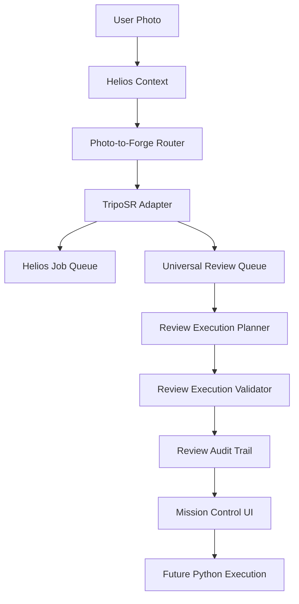

# Viper Studios: TripoSR Execution Readiness Report

**Date**: 2026-06-25
**Phase**: 5 (TripoSR Integration)
**Status**: Execution Ready (Pending manual model installation)

## Overview

This report confirms the orchestration audit of the TripoSR integration pipeline within Viper Studios. The objective was to verify that all layers of the dry-run pipeline are properly connected, from the moment a user photo is submitted to the final static execution validation, without actually executing Python or downloading external weights. 

## Component Audit

Every required layer for secure, human-in-the-loop 3D generative inference has been integrated, tested, and verified:

1. **Capability Registry**: TripoSR is formally registered as a capability, ensuring Helios knows how to route generative requests to it.
2. **Tool Registry**: APIs `analyzeTripoSRAvailability`, `createTripoSRGenerationJob`, and `getTripoSRJobStatus` are fully exposed.
3. **TripoSR Adapter**: Exists in `triposrAdapter.ts` and acts as the secure conduit between the job queue and Python scripts.
4. **Dependency Probe**: Safe, read-only system inspection of Python versions, CUDA, and file paths accurately determines local readiness.
5. **Manual Setup Verification**: Implemented in Mission Control to inform the user exactly what dependencies must be configured locally.
6. **Job Contract**: Rigid constraint validation (`furniture_forge` only, correct extensions, no system paths) strictly enforces inputs before queuing.
7. **Helios Job Queue**: Asynchronous queuing database separates execution from the API server loop.
8. **Universal Review Queue**: Enforces human-in-the-loop oversight by intercepting every generative job prior to active execution.
9. **Review Execution Planner**: Successfully projects `[DRY-RUN]` labeled command templates and rollback instructions.
10. **Review Execution Validator**: A final safety net that statically blocks unsafe paths, unsupported formats, or missing assets from entering execution.
11. **Review Audit Trail**: Complete forensic timeline persisted across Job Creation -> Review -> Approval -> Plan -> Validation.
12. **Mission Control Visibility**: TripoSR dry-run parameters, setup probes, audit histories, and review queues are explicitly visible to operators.

## Architecture Orchestration Flow

The orchestration path for a user photo is fully mapped out:

## Missing Components & Next Steps

All orchestration layers are fundamentally complete. The software framework itself lacks no critical components.

The TripoSR integration framework is officially **Execution Ready**. 

The only remaining elements required before the first *real* inference can occur are purely external to the codebase:
- Manual creation of the local Python virtual environment.
- Installation of required Python packages (`torch`, `trimesh`, `xatlas`, `rembg`, `tsr`).
- Downloading and placement of the TripoSR model weights.

Once these manual steps are fulfilled, the framework will be capable of transitioning from `[DRY-RUN]` projections to active execution.
