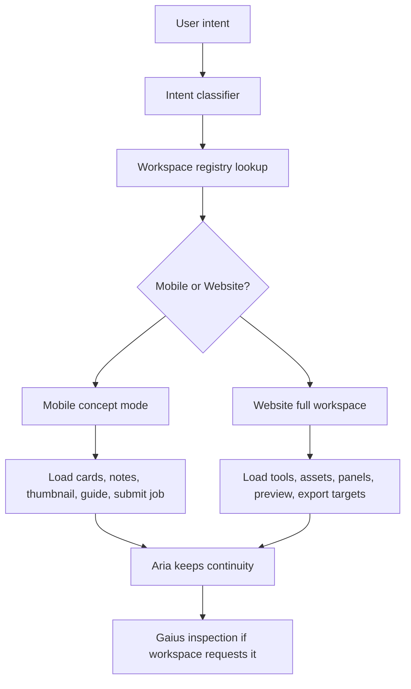

# Viper Studios Turntable Workspace System Design

Date: 2026-06-14

Status: planning only.

Do not implement yet. Do not rewrite Forge yet. Do not delete features. Do not move files yet.

## Current Scope Corrections

This design follows the Turntable mission while preserving the newer Viper Studios direction:

- Aria must work first.
- The Turntable supports Aria. It does not replace her.
- Gaius may appear as a secondary inspector/build-check guide.
- Mobile is a light companion/control center.
- Website/Forge is the full factory.
- Fluff remains paused.
- OpenClaw remains unresolved until freshly verified.
- MakeHuman and MPFB are retired from active Viper scope.
- Public avatar creation and skin creation are retired from active Viper scope.
- Protected Aria/Gaius assets are not public creator bases.
- Clothing can use protected fit references, but Viper should not ship public avatar bases or skin-generation tools.

## 1. Definition

The Turntable is the workspace selector and loader for Viper Studios.

It is not a spinning decoration. It is the system that answers:

> What is the user trying to build, and which exact workspace should Viper load?

Example:

User intent: "I want to build a spacecraft."

Active workspace: `spacecraft_forge`

Loaded:

- Spacecraft tools.
- Spacecraft preview scene.
- Spacecraft asset library.
- Spacecraft UI panels.
- Spacecraft export targets.
- Aria or Gaius spacecraft guidance.

Unloaded or hidden:

- Clothing tools.
- Furniture tools.
- Full world tools.
- Animation systems.
- Avatar/skin systems.
- Any other unrelated heavy systems.

The Turntable prevents Forge from trying to load the whole universe at once.

## 2. Primary Rule: Aria First

Aria is the central guide, builder, and project assistant.

The Turntable must:

- Keep Aria available across all workspaces.
- Give Aria the current workspace ID and project context.
- Let Aria explain what tools are available.
- Let Aria warn when something belongs on Website/Forge instead of mobile.
- Let Aria help submit mobile jobs to the full Forge.
- Preserve Aria memory when workspaces unload.

The Turntable must not:

- Replace Aria.
- Hide Aria during workspace switching.
- Treat a workspace as more important than project continuity.

## 3. Gaius Role

Gaius is the practical builder and inspector guide.

Aria guides creative flow.

Gaius checks whether the build makes sense.

Gaius is useful for:

- Scale checks.
- Function checks.
- Build logic.
- Structural warnings.
- Export readiness.
- Plain-spoken construction feedback.

Gaius should be optional per workspace, not globally required.

## 4. Mobile-Lite vs Website-Full

### Mobile Turntable

Mobile should load:

- Simple workspace cards.
- Lightweight thumbnails.
- Text prompts.
- Saved notes.
- Small preview images.
- Aria/Gaius guidance.
- Submit-to-Forge job actions.
- Project status and approval controls.

Mobile should not load:

- Full 3D rig editing.
- High-poly GLB/FBX assets.
- Full animation mixers.
- Blender-level tools.
- CC5-level tools.
- Full Starfield/Skyrim export systems.
- Full world editors.
- Heavy texture baking.
- Avatar rig pipelines.
- MakeHuman-derived systems.

### Website / Forge Turntable

Website/Forge should load full workspaces, but only one active workspace should be heavy at a time.

Website/Forge may load full versions of:

- Clothing Forge.
- Weapon Forge.
- Furniture Forge.
- Building Forge.
- Vehicle Forge.
- Spacecraft Forge.
- Room Forge.
- World Forge.
- Texture/Material Forge.
- Export Forge.

Deferred or quarantined:

- Avatar Forge: not active for public creator products. Protected Aria/Gaius internal maintenance only.
- Skin Forge: retired from active scope. Human skin generation should not be part of Viper creator tools.
- Creature Forge: deferred until the product scope is explicitly approved again.
- Animation Forge: website-only and later, after stable workspace loading exists.
- Mod Forge: website-only and later, after object/product export workflows are stable.

## 5. Registry Schema

Every workspace should be represented by lightweight metadata first.

Recommended registry shape:

```ts
type ViperWorkspaceMode =
  | "disabled"
  | "metadata_only"
  | "concept_only"
  | "full_workspace"
  | "internal_only";

type ViperPerformanceRisk = "low" | "medium" | "high" | "very_high";

type ViperGuideMode = {
  aria: "primary" | "available" | "hidden";
  gaius: "optional" | "recommended" | "hidden";
};

type ViperWorkspaceRegistryEntry = {
  workspace_id: string;
  name: string;
  category: string;
  active_scope: "active" | "deferred" | "retired" | "internal_protected";
  mobile_mode: ViperWorkspaceMode;
  website_mode: ViperWorkspaceMode;
  required_tools: string[];
  required_assets: string[];
  required_panels: string[];
  preview_scene: string;
  guide_mode: ViperGuideMode;
  export_targets: string[];
  performance_risk: ViperPerformanceRisk;
  unload_rules: string[];
  scope_notes: string[];
};
```

Key rule: inactive workspaces should remain metadata only.

## 6. Loading Rules

When a workspace activates:

1. Set active workspace ID.
2. Load only that workspace registry entry.
3. Load only required tool modules.
4. Load only required asset libraries.
5. Load only required UI panels.
6. Load only required preview scene.
7. Attach Aria guide behavior.
8. Attach Gaius only if useful for that workspace.
9. Hide unrelated systems.
10. Preserve project memory.
11. Preserve user session state.
12. Warn if the requested action is website-only.

When a workspace deactivates:

1. Save workspace state.
2. Release heavy assets.
3. Pause unused render loops.
4. Remove unused UI panels.
5. Keep only lightweight metadata.
6. Keep Aria memory active.
7. Keep project summary available for the next workspace.

## 7. Workspace Registry Draft

### texture_material_forge

Purpose: create and apply materials, fabrics, metals, dirt, wear, glow, decals, trims, and surface styles.

Mobile mode: `concept_only`

Website mode: `full_workspace`

Required tools:

- Material picker.
- Texture slot editor.
- Color controls.
- Roughness/metalness controls.
- UV preview.
- Material variation notes.

Required assets:

- Material presets.
- Texture samples.
- UV maps.
- Fabric references.
- Metal references.
- Surface wear references.

Required panels:

- Materials.
- Texture slots.
- UV preview.
- Color.
- Export.
- Guidance.

Preview scene:

- Material ball or simple object preview.

Guide mode:

- Aria primary.
- Gaius optional for material practicality and export checks.

Export targets:

- PNG.
- JPG.
- Material preset.
- GLB.
- FBX.
- Viper package.

Performance risk: low on mobile, medium on website.

Unload rules:

- Release large texture previews.
- Unload unused material families.
- Keep material recipe metadata.

Scope notes:

- This workspace excludes human skin generation.
- This should be the first prototype because it helps every other workspace.

### furniture_forge

Purpose: create furniture, props, room objects, and placeable set pieces.

Mobile mode: `concept_only`

Website mode: `full_workspace`

Required tools:

- Object builder.
- Size controls.
- Material picker.
- Snap points.
- Collision marker.
- Placement notes.

Required assets:

- Chairs.
- Tables.
- Beds.
- Shelves.
- Lamps.
- Sci-fi props.
- Fantasy props.
- Room objects.

Required panels:

- Object library.
- Materials.
- Dimensions.
- Placement.
- Export.
- Guidance.

Preview scene:

- Room/object preview.

Guide mode:

- Aria primary.
- Gaius recommended for scale, collision, and placement checks.

Export targets:

- IMVU.
- Starfield.
- Skyrim.
- GLB.
- FBX.
- Viper package.

Performance risk: low to medium.

Unload rules:

- Unload unused object libraries.
- Release preview scene.
- Keep object card and dimensions.

Scope notes:

- Recommended second prototype.

### clothing_forge

Purpose: create clothing concepts, test fit against protected references, define materials, layers, and export-ready clothing assets.

Mobile mode: `concept_only`

Website mode: `full_workspace`

Required tools:

- Pattern selector.
- Fit preview.
- Material picker.
- Seam/layer controls.
- Slot assignment.
- Export checks.

Required assets:

- Protected fit references.
- Clothing templates.
- Fabric presets.
- UV templates.

Required panels:

- Garments.
- Materials.
- Fit.
- Layers.
- Export.
- Guidance.

Preview scene:

- Clothing preview on protected fit reference, not public avatar base.

Guide mode:

- Aria primary.
- Gaius recommended for fit and export checks.

Export targets:

- IMVU.
- GLB.
- FBX.
- Viper package.

Performance risk: medium.

Unload rules:

- Unload garment libraries not in use.
- Release fit preview scene.
- Keep product card and measurements.

Scope notes:

- Do not expose public avatar creation.
- Do not expose skin generation.
- Do not use MakeHuman as an active base.

### weapon_forge

Purpose: create weapons, tools, handheld props, and modular combat assets.

Mobile mode: `concept_only`

Website mode: `full_workspace`

Required tools:

- Shape builder.
- Grip placement.
- Barrel modules.
- Blade modules.
- Toolhead modules.
- Material controls.

Required assets:

- Weapon parts.
- Handles.
- Blades.
- Barrels.
- Tool parts.
- Sci-fi presets.
- Fantasy presets.

Required panels:

- Parts.
- Attachments.
- Materials.
- Scale.
- Export.
- Guidance.

Preview scene:

- 3D object preview with hand/scale reference.

Guide mode:

- Aria primary.
- Gaius recommended for grip, balance, and scale checks.

Export targets:

- Starfield.
- Skyrim.
- GLB.
- FBX.
- Viper package.

Performance risk: medium.

Unload rules:

- Unload unused weapon part libraries.
- Release preview scene.
- Keep product card and modular recipe.

Scope notes:

- Active scope.

### building_forge

Purpose: create structures, walls, rooms, doors, windows, floors, roofs, and modular buildings.

Mobile mode: `concept_only`

Website mode: `full_workspace`

Required tools:

- Wall builder.
- Floor planner.
- Roof tools.
- Door/window placement.
- Snap grid.
- Scale checker.

Required assets:

- Walls.
- Floors.
- Doors.
- Windows.
- Stairs.
- Roofs.
- Structural kits.

Required panels:

- Structure.
- Parts.
- Materials.
- Scale.
- Preview.
- Export.
- Guidance.

Preview scene:

- 3D building preview.

Guide mode:

- Aria primary.
- Gaius recommended for structure and scale checks.

Export targets:

- Starfield.
- Skyrim.
- GLB.
- FBX.
- Viper package.

Performance risk: high.

Unload rules:

- Unload unused structural kits.
- Pause heavy previews.
- Keep floor plan metadata.

Scope notes:

- Website-first for full authoring.

### vehicle_forge

Purpose: create ground vehicles, hover vehicles, carts, machinery, and vehicle props.

Mobile mode: `concept_only`

Website mode: `full_workspace`

Required tools:

- Chassis builder.
- Wheel/tread placement.
- Engine placement.
- Cockpit/seat tools.
- Material controls.
- Scale checker.

Required assets:

- Chassis parts.
- Wheels.
- Engines.
- Seats.
- Lights.
- Armor panels.

Required panels:

- Frame.
- Parts.
- Materials.
- Movement logic.
- Scale.
- Export.
- Guidance.

Preview scene:

- Vehicle garage preview.

Guide mode:

- Aria primary.
- Gaius recommended for function and scale checks.

Export targets:

- Starfield.
- GLB.
- FBX.
- Viper package.

Performance risk: high.

Unload rules:

- Unload unused vehicle kits.
- Release preview scene.
- Keep vehicle card and assembly notes.

Scope notes:

- Website-first for full construction.

### spacecraft_forge

Purpose: create spacecraft, ships, fighters, cockpits, engines, weapon mounts, and modular space builds.

Mobile mode: `concept_only`

Website mode: `full_workspace`

Required tools:

- Hull builder.
- Cockpit selector.
- Engine mounts.
- Weapon mounts.
- Landing gear.
- Scale checker.

Required assets:

- Hull parts.
- Wings.
- Engines.
- Cockpits.
- Weapons.
- Landing gear.
- Starfield scale references.

Required panels:

- Ship parts.
- Modules.
- Materials.
- Scale.
- Preview.
- Export.
- Guidance.

Preview scene:

- 3D hangar/spacecraft preview.

Guide mode:

- Aria primary.
- Gaius recommended for inspection, scale, and layout checks.

Export targets:

- Starfield.
- GLB.
- FBX.
- Viper package.

Performance risk: very high.

Unload rules:

- Unload unused part libraries.
- Pause animation systems.
- Hide unrelated tools.
- Release heavy hangar preview when inactive.

Scope notes:

- Important, but not first prototype.
- Do not prototype before the Turntable loading model is stable.

### room_forge

Purpose: create room layouts, interior sets, walls, props, lighting, and placeable room packages.

Mobile mode: `concept_only`

Website mode: `full_workspace`

Required tools:

- Room layout.
- Object placement.
- Wall/floor material picker.
- Lighting controls.
- Snap points.

Required assets:

- Room shells.
- Wall sets.
- Floor sets.
- Furniture references.
- Prop sets.
- Lighting presets.

Required panels:

- Layout.
- Objects.
- Materials.
- Lighting.
- Export.
- Guidance.

Preview scene:

- Room preview.

Guide mode:

- Aria primary.
- Gaius recommended for layout and collision checks.

Export targets:

- IMVU.
- GLB.
- FBX.
- Viper package.

Performance risk: medium to high.

Unload rules:

- Unload unused room kits.
- Release lightmap/preview data.
- Keep room card and object list.

Scope notes:

- Good follow-up after Furniture Forge.

### world_forge

Purpose: create world concepts, environments, biomes, exterior scenes, and staging spaces.

Mobile mode: `concept_only`

Website mode: `full_workspace`

Required tools:

- Biome selector.
- Terrain/scene planner.
- Lighting/weather notes.
- Prop distribution.
- Scale notes.

Required assets:

- Biome references.
- Environment presets.
- Terrain references.
- Sky/lighting references.
- Prop sets.

Required panels:

- Biome.
- Scene.
- Materials.
- Lighting.
- Export.
- Guidance.

Preview scene:

- Environment preview.

Guide mode:

- Aria primary.
- Gaius optional for scale and logic checks.

Export targets:

- GLB.
- FBX.
- Viper package.

Performance risk: high.

Unload rules:

- Do not keep full world preview active when hidden.
- Release environment libraries when inactive.
- Keep world brief and thumbnail.

Scope notes:

- Website-first for full world editing.

### export_forge

Purpose: validate and package products for target outputs.

Mobile mode: `metadata_only`

Website mode: `full_workspace`

Required tools:

- Package validator.
- Target profile selector.
- File manifest builder.
- Thumbnail checker.
- Export readiness checklist.

Required assets:

- Target platform rules.
- Export templates.
- Naming rules.
- Package manifests.

Required panels:

- Target.
- Checklist.
- Manifest.
- Preview.
- Errors.
- Guidance.

Preview scene:

- Package/thumbnail preview.

Guide mode:

- Aria primary.
- Gaius recommended for readiness checks.

Export targets:

- IMVU.
- Starfield.
- Skyrim.
- GLB.
- FBX.
- PNG.
- JPG.
- Viper package.

Performance risk: medium.

Unload rules:

- Release generated previews.
- Keep package manifest metadata.

Scope notes:

- Website-first. Mobile can show status, warnings, and approval controls.

## 8. Retired, Deferred, And Protected Workspaces

### avatar_forge

Active scope: `internal_protected`

Mobile mode: `disabled`

Website mode: `internal_only`

Use only for protected Aria/Gaius maintenance or inspection if explicitly approved.

Do not expose as public creator base tooling.

Do not use MakeHuman/MPFB as the active base.

### skin_forge

Active scope: `retired`

Mobile mode: `disabled`

Website mode: `disabled`

Human skin generation is outside active Viper scope.

Texture/Material Forge may create fabric, metal, painted surfaces, dirt, wear, glow, decals, trims, and object materials, but not public human skin products.

### creature_forge

Active scope: `deferred`

Mobile mode: `metadata_only`

Website mode: `metadata_only`

Creature work should not be part of the first Turntable implementation. Revisit only if the user explicitly reopens that scope.

### animation_forge

Active scope: `deferred`

Mobile mode: `disabled`

Website mode: `metadata_only`

Animation is website-only and later. It should use real CC5-derived or approved source clips, not fake pose math.

### mod_forge

Active scope: `deferred`

Mobile mode: `disabled`

Website mode: `metadata_only`

Starfield/Skyrim export packaging is website-only and later. Mobile may show job status but should not run package assembly.

### openclaw_support

Active scope: `deferred`

Mobile mode: `disabled`

Website mode: `metadata_only`

OpenClaw remains unresolved and should receive a separate verification pass before it becomes part of any active workspace.

## 9. Workspace Activation Flow



## 10. Mobile Turntable UX

Mobile should feel like a focused control center.

Mobile first screen should ask:

> Who would you like to build with today?

Guide choices:

- Aria.
- Gaius.

After guide choice, mobile can show Turntable workspace cards:

- Materials.
- Furniture.
- Clothing.
- Weapons/Tools.
- Buildings.
- Vehicles.
- Spacecraft.
- Rooms.
- Worlds.

Each card should load only:

- Lightweight category metadata.
- Recent projects in that category.
- Notes.
- Prompt box.
- Thumbnail/reference image.
- Submit-to-Forge button.
- Aria/Gaius guidance.

No heavy 3D workspace should load by default.

## 11. Website Forge UX

Website/Forge should be the full workspace host.

Recommended modules:

- Dashboard.
- Product Library.
- Turntable Workspace Selector.
- Active Workspace.
- Guidance panel.
- Properties panel.
- Preview scene.
- Export/package panel.
- Job queue.

Website should still avoid loading every workspace at once. The full website can be powerful without being wasteful.

## 12. First Prototype

Prototype first:

### Texture/Material Forge

Reasons:

- Useful across every future workspace.
- Lighter than spacecraft, animation, avatar, creature, or world systems.
- Tests mobile-lite and website-full separation.
- Tests registry lookup.
- Tests Aria guidance.
- Tests optional Gaius inspection.
- Tests export/job handoff.
- Avoids retired avatar/skin scope by focusing on object materials, fabrics, metal, paint, dirt, wear, glow, and decals.

Second prototype:

### Furniture Forge

Reasons:

- Easier than spacecraft, vehicles, worlds, animation, or character systems.
- Proves object building.
- Proves materials.
- Proves dimensions and scale.
- Proves placement/collision checks.
- Proves export readiness without loading the whole Forge.

Do not prototype Spacecraft Forge first. It matters, but it is too heavy for the first proof of the loader.

## 13. Do Not Build Yet

Do not:

- Build every workspace.
- Rewrite Forge.
- Move files.
- Delete systems.
- Load all workspace libraries at startup.
- Build full mobile 3D editors.
- Build full spacecraft tools.
- Build full animation tools.
- Build full avatar replacement systems.
- Reintroduce MakeHuman.
- Build public skin creation.
- Replace Aria.
- Make the Turntable a visual gimmick before it works as a loader.

## 14. Recommended Next Approval Point

Before implementation, approve this narrow prototype:

> Build a Turntable registry plus Texture/Material Forge prototype in planning-safe increments.

Implementation should start with metadata and UI flow only:

1. Define the workspace registry.
2. Add Texture/Material Forge as the first active workspace.
3. Add Furniture Forge as metadata only.
4. Add retired/deferred entries for Avatar/Skin/Creature/Animation/Mod/OpenClaw.
5. Add mobile concept-mode cards.
6. Add website full-workspace shell.
7. Keep heavy assets unloaded by default.
8. Keep Aria available throughout.

No existing features need to be deleted or moved for the first implementation pass.

## Final Summary

The Turntable Workspace System is the loading brain for Viper Studios.

It lets Viper choose the right workspace for the thing being built, then load only the tools, assets, panels, preview, guides, and export targets that workspace needs.

Website/Forge gets the full power system.

Mobile gets lightweight concept mode and job submission.

Aria remains the main project guide.

Gaius becomes the practical inspector.

The first prototype should be Texture/Material Forge, followed by Furniture Forge.

The goal:

- Keep Viper fast.
- Keep Forge focused.
- Keep mobile light.
- Keep Aria first.
- Load only what the user is building.

