# Viper Studios Part-Wise Architecture

This document defines the core decomposition, instantiation, and interface strategies for the Colonial Viper manufacturing pipeline.

## 1. Component Decomposition Diagram (Colonial Viper)

```mermaid
graph TD
    Viper[Colonial Viper] --> Forward[FORWARD ASSEMBLY]
    Viper --> Center[CENTER ASSEMBLY]
    Viper --> LeftWing[LEFT ASSEMBLY]
    Viper --> RightWing[RIGHT ASSEMBLY]
    Viper --> Propulsion[PROPULSION ASSEMBLY]
    Viper --> Landing[LANDING SYSTEM]

    Forward --> N_Shell[Nose Outer Shell]
    Forward --> N_Bezel[Nose Intake Bezel]
    Forward --> N_Cavity[Nose Intake Cavity]
    Forward --> C_Canopy[Cockpit Canopy]
    Forward --> C_Surround[Cockpit Surround / Transition]

    Center --> F_Central[Central Fuselage]
    Center --> F_Spine[Upper Spine]
    Center --> F_Dorsal[Dorsal Fin]

    LeftWing --> W_L_Root[Left Wing Root]
    LeftWing --> W_L_Main[Left Wing Main]
    LeftWing --> G_L_Gun[Left Primary Gun]

    RightWing --> W_R_Root[Right Wing Root]
    RightWing --> W_R_Main[Right Wing Main]
    RightWing --> G_R_Gun[Right Primary Gun]

    Propulsion --> E_Upper[Upper Engine Housing]
    Propulsion --> E_LowerL[Lower-Left Engine Housing]
    Propulsion --> E_LowerR[Lower-Right Engine Housing]
    Propulsion --> E_Internal[Canonical Engine Internal Module]
    Propulsion --> E_Nozzle[Engine Exhaust/Nozzle Module]

    Landing --> L_Front[Front Landing Ski]
    Landing --> L_Left[Left Landing Ski]
    Landing --> L_Right[Right Landing Ski]
```



## 2. AssetPartManifest Schema

The `AssetPartManifest` is the fundamental definition for every manufactured component in Viper Studios.

```json
{
  "$schema": "http://json-schema.org/draft-07/schema#",
  "title": "AssetPartManifest",
  "type": "object",
  "properties": {
    "part_id": { "type": "string", "description": "Unique identifier for the part (e.g., VIPER_NOSE_SHELL_V1)" },
    "canonical_name": { "type": "string" },
    "parent_asset": { "type": "string", "description": "The macro object this belongs to (e.g., COLONIAL_VIPER)" },
    "parent_part": { "type": "string", "description": "The assembly this part belongs to (e.g., FORWARD_ASSEMBLY)" },
    "asset_class": { "type": "string", "enum": ["VEHICLES", "WEAPONS", "FURNITURE", "BUILDINGS", "CREATURES", "AVATARS", "MACHINERY"] },
    
    "bounding_region": {
      "type": "object",
      "properties": {
        "min": { "type": "array", "items": { "type": "number" }, "minItems": 3, "maxItems": 3 },
        "max": { "type": "array", "items": { "type": "number" }, "minItems": 3, "maxItems": 3 }
      }
    },
    
    "known_dimensions": { "type": "object" },
    
    "reference_bundle": {
      "type": "object",
      "properties": {
        "primary_views": { "type": "array", "items": { "type": "string" } },
        "depth_views": { "type": "array", "items": { "type": "string" } },
        "masks": { "type": "array", "items": { "type": "string" } },
        "landmarks": { "type": "object" },
        "normals": { "type": "array", "items": { "type": "string" }, "description": "Derived Geometry Guidance" }
      }
    },
    
    "surface_knowledge": {
      "type": "object",
      "properties": {
        "observed_surfaces": { "type": "array", "items": { "type": "string" } },
        "inferred_surfaces": { "type": "array", "items": { "type": "string" } },
        "unknown_surfaces": { "type": "array", "items": { "type": "string" } }
      }
    },
    
    "instancing": {
      "type": "object",
      "properties": {
        "is_instance": { "type": "boolean" },
        "instance_source": { "type": "string" },
        "symmetry_relationship": { "type": "string", "description": "e.g., MIRROR_X_OF: VIPER_INTAKE_PORT" }
      }
    },
    
    "interfaces": {
      "type": "array",
      "items": {
        "type": "object",
        "properties": {
          "interface_type": { "type": "string", "enum": ["SOCKET", "MOUNT", "SEAM", "FLANGE", "HINGE", "RAIL", "BEARING", "SURFACE_BOUNDARY"] },
          "target_part": { "type": "string" },
          "transform": { "type": "array", "items": { "type": "number" } },
          "continuity_requirement": { "type": "string", "enum": ["G0_POSITION", "G1_TANGENT", "G2_CURVATURE", "GAP_ALLOWED"] }
        }
      }
    },
    
    "manufacturing": {
      "type": "object",
      "properties": {
        "method": { "type": "string" },
        "material_expectation": { "type": "string" }
      }
    },
    
    "validation": {
      "type": "object",
      "properties": {
        "status": { "type": "string" },
        "creator_acceptance": { "type": "string", "enum": ["PART_APPROVED", "PART_APPROVED_WITH_CORRECTIONS", "PART_REJECTED", "PENDING_CREATOR_REVIEW"] }
      }
    }
  },
  "required": ["part_id", "canonical_name", "interfaces"]
}
```

## 3. Interface / Socket Plan

Before surface detailing begins, components must guarantee spatial accuracy through well-defined connections.

**Rules of Connection:**
1. **No Silent Welding**: Vertices should not be merged across components just to hide bad alignment. Parts must structurally align based on their interface definitions.
2. **Transform Hierarchy**: Sockets act as origin points for child components.

**Forward Assembly Interfaces:**
*   `Nose Outer Shell` [SEAM: Rear Boundary] $\rightarrow$ `Cockpit Surround`
*   `Cockpit Surround` [MOUNT: Glass Rim] $\rightarrow$ `Cockpit Canopy`
*   `Nose Outer Shell` [SURFACE_BOUNDARY: Port Cutout] $\rightarrow$ `Intake Bezel (Port)`
*   `Nose Outer Shell` [SURFACE_BOUNDARY: Starboard Cutout] $\rightarrow$ `Intake Bezel (Starboard)`
*   `Intake Bezel` [SEAM: Inner Lip] $\rightarrow$ `Intake Cavity`

## 4. Canonical Instance Plan

To adhere to **Rule 42 (Exploit Instancing)**, the following parts will be built *once* as Canonical Assets and reused via mirrored or offset instances.

| Canonical Source Component | Instances Required | Transformation |
| :--- | :--- | :--- |
| **VIPER_INTAKE_BEZEL_CANONICAL** | Port Intake Bezel | Identity (Source side) |
| | Starboard Intake Bezel | `Mirror X` |
| **VIPER_INTAKE_CAVITY_CANONICAL** | Port Intake Cavity | Identity |
| | Starboard Intake Cavity | `Mirror X` |
| **VIPER_PRIMARY_GUN_CANONICAL** | Port Wing Gun | Translate Offset |
| | Starboard Wing Gun | Translate Offset + `Mirror X` |
| **VIPER_ENGINE_INTERNAL_CANONICAL**| Upper Engine Core | Translate (Top) |
| | Lower Left Engine Core | Translate (Lower Port) |
| | Lower Right Engine Core | Translate (Lower Starboard) |
| **VIPER_LANDING_SKI_CANONICAL** | Port Landing Ski | Translate Offset |
| | Starboard Landing Ski | Translate Offset + `Mirror X` |

*Note: The Front Landing Ski may require a unique canonical mesh if its geometry differs significantly from the rear skis.*
